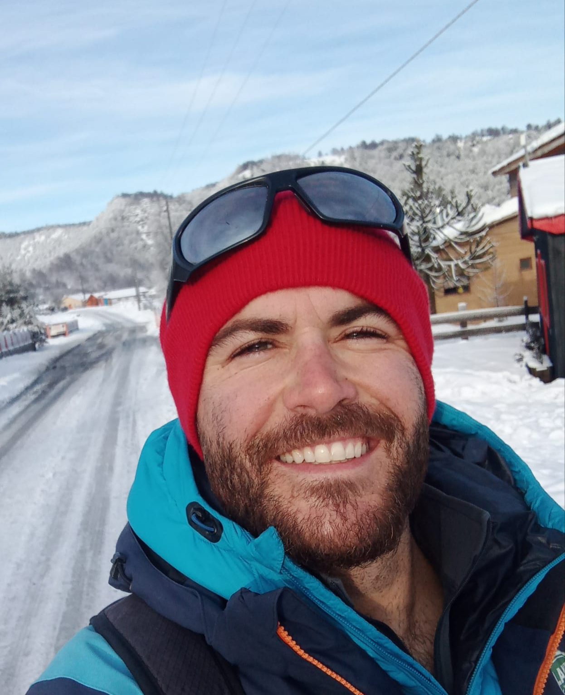
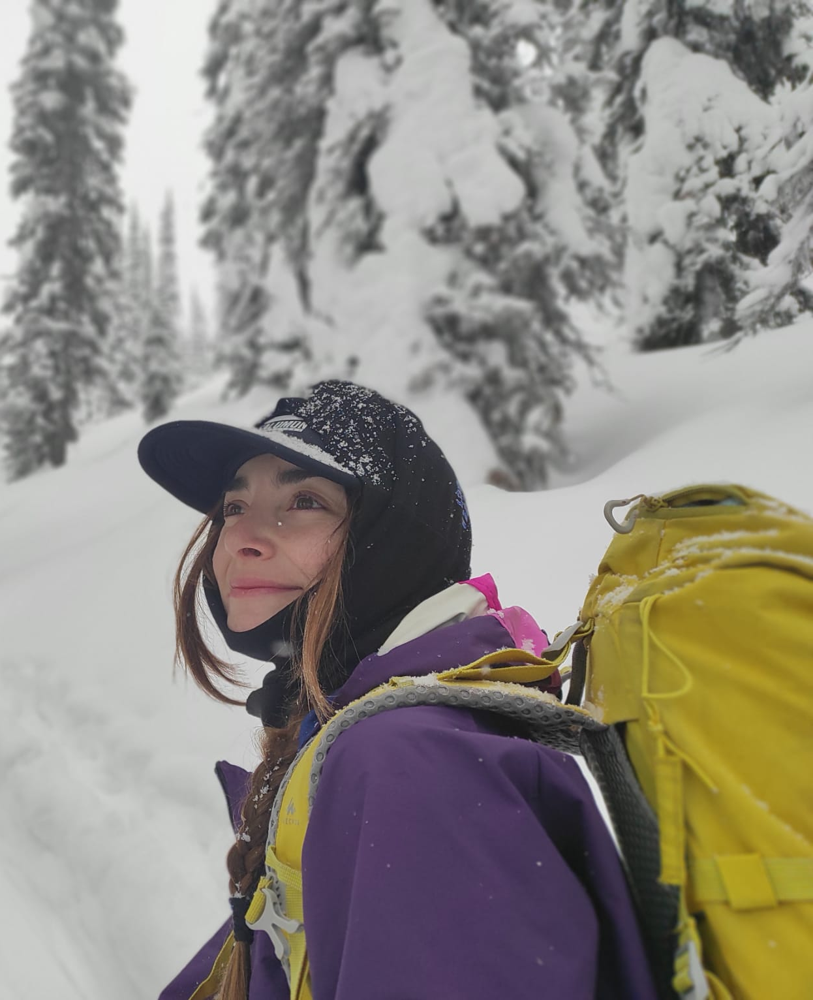
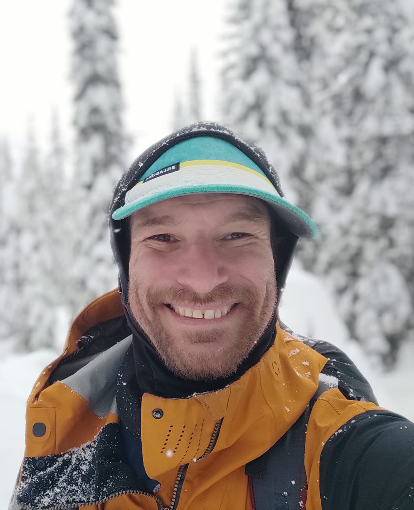

# Red de Inclusión Deportiva (RID)

## What
At RID, as a sports non profit organisation, we believe that sports have the power to break social and mental barriers, build confidence, and foster inclusion.
Our mission is to empower individuals with physical and intellectual disabilities by providing opportunities to engage in sports, showcasing their strength, resilience, and potential.

We are dedicated to promoting self-improvement and personal growth through inclusive sporting activities, where everyone, regardless of ability, can thrive and challenge their limits. Our programs aim to not only enhance physical abilities but also support mental well-being, encourage social interaction, and foster a sense of community.

By highlighting the achievements of athletes with disabilities, we aim to inspire others, raise awareness, and create a world where everyone has the opportunity to reach their fullest potential, both on and off the field. Join us in our commitment to inclusivity and empowerment through sport! 

## Who

Arnau is a highly skilled ski expert with a rich background in alpine and adaptive skiing, spanning nearly a decade of professional experience in renowned ski destinations across Europe and South America.  

Alongside his professional achievements, he has contributed as an educational support specialist for students with disabilities.          

Francisca Núñez Ayllach is an alpine ski instructor and an experienced project manager, with diverse professional background in sports, ecotourism and international collaboration.

Due to that she has demonstrated exceptional skill in managing projects, particularly in the field of adaptive skiing and outdoor education. 

Andrea Menescardi, is an internationally recognized trainer in adapted sports, with a specialization in adaptive skiing.

With extensive experience, he has dedicated his career to inclusivity and excellence in sports, combining technical expertise with a passion for empowering individuals of all abilities.

## Where

hi@championsfactory.bg

Manastirski Livadi, ul. Mur 27, 1680 Sofia, Bulgaria

...Mes dades?
